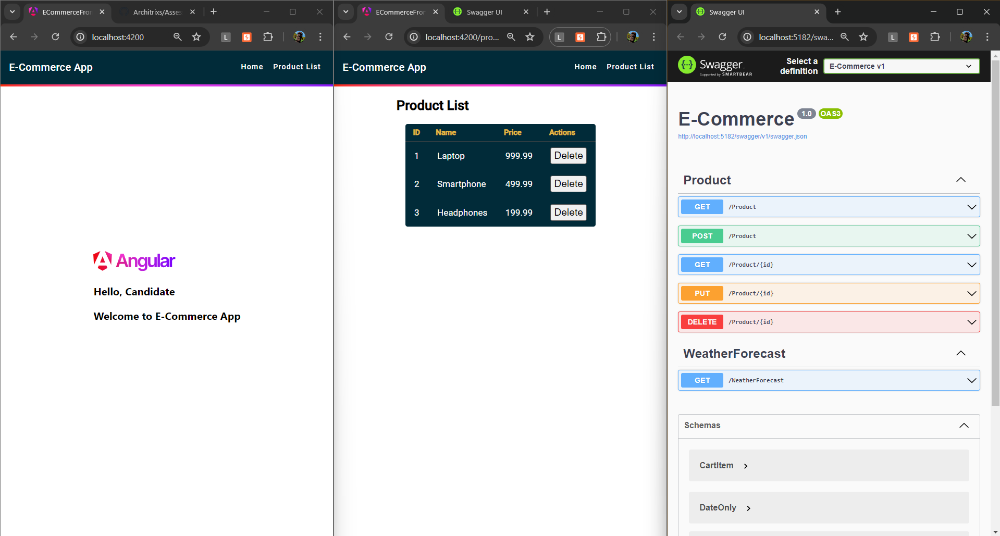

# E-commerce Platform Assignment
<sub>Please thoroughly read the instructions before starting the assignment.</sub>

## Overview

You are tasked with developing an E-commerce Platform that includes the following features:
- Shopping cart management.
- Application of discount codes.
- Generation of sales reports.

This assignment will help evaluate your skills in both backend and frontend development, focusing on programming logic and database management.

## Setting up the DotNet API

1. Open a terminal in the root directory (Where Program.cs file is)
2. Either run the command `dotnet run` or use any IDE (Visual Studio, vscode) to run the API

## Setting up the Angular application

1. Open a terminal and navigate to the `E-Commerce-frontend` directory
2. Run the command `npm install` to install the dependencies
3. Run the command `ng serve` to start the Angular application

The application should now be running at `http://localhost:4200/`

## Functional Requirements

1. **Shopping Cart Management:**
   - Calculate the total value of items in a user's shopping cart, considering discounts and taxes.
    `CartItems` table stores the items in the shopping cart, and `Products` table contains the product details.
    The total value should include the sum of all products in the cart, applying any discounts.
   
2. **Discount Code Application:**
   - Apply discount codes to the shopping cart and validate their conditions.
    `DiscountPercentage` is a value between 0 and 1, representing the percentage discount to apply.
    To apply a discount, the user must enter a valid `DiscountCode` that exists in the `Discounts` table.

3. **Sales Report Generation:**
   - Generate a daily sales report summarizing total revenue and most sold products.
    `Sales` table stores the total amount of each sale, and `SalesItems` table contains the products sold in each sale.
    The report should include the total revenue for the day and the products that were sold the most.

## Non-Functional Requirements

1. **Data Consistency and Integrity:**
   - Ensure data is accurate and consistent.
   
2. **Code Quality:**
   - Write clean, readable, and maintainable code following best practices.
   
3. **Testing:** (Optional)
   - Include unit tests to verify the functionality of the application.

## Database Schema

Here is the SQLite schema for the E-commerce platform:

```sql
CREATE TABLE Products (
    ProductID INTEGER PRIMARY KEY,
    ProductName TEXT NOT NULL,
    Price REAL NOT NULL
);

CREATE TABLE Discounts (
    DiscountID INTEGER PRIMARY KEY,
    DiscountCode TEXT NOT,
    DiscountPercentage REAL NOT NULL
);

CREATE TABLE CartItems (
    CartItemID INTEGER PRIMARY KEY,
    ProductID INTEGER,
    Quantity INTEGER NOT NULL,
);

CREATE TABLE Sales (
    SaleID INTEGER PRIMARY KEY,
    TotalAmount REAL NOT NULL,
    SaleDate TEXT NOT NULL
);

CREATE TABLE SalesItems (
    SalesItemID INTEGER PRIMARY KEY,
    SaleID INTEGER,
    ProductID INTEGER,
    Quantity INTEGER NOT NULL,
);
```
A SQLite database file `SQLLiteDatabase.db` is included in the project with some sample data.
You can view the database using a SQLite plugin in IDE or any other tool of your choice.

### .NET Web API

- Implement controllers for managing products, discounts, cart items, and generating reports.
- Should include basic CRUD operations and custom endpoints for specific functionalities.
- Add Services for Talking to the SQLite Database

An Example `ProductController` and `ProductService` are Already Made for You.


### Angular Frontend
- Create components for displaying products, managing the shopping cart, and viewing sales reports.

- Show a page for User to Add Products to the their Cart `ShoppingCartComponent`
  The Page should show the following:
  - List of Products
  - Quantity Input for each Product that is added to the Cart
  - Add to Cart Button
  - Total Value of the Cart
  - Discount Code Available and Input Field to Apply Discount Code
  - Apply Discount Button
  - Total Value of the Cart after Discount
    
    Functionality:
  - Add Products to the Cart
  - Increase or Decrease Quantity of the Product in the Cart
  - Calculate Total Value of the Cart
  - Apply Discount Code to the Cart
  - Calculate Total Value of the Cart after Discount
  
- Show a page for Admin to Generate Sales Report `SalesReportComponent`
  The Page should show the following:
    - Total Revenue for the Day
    - Most Sold Products
    - List of Products Sold
    - Quantity of Each Product Sold
    - Total Revenue from Each Product
- Show a Product Management Page `ProductListComponent`
  The Page should show the following:
    - List of Products in a Table
    - Add Product Button
    - Edit Product Button
    - Delete Product Button
    - Form for Adding/Editing Product
  
  Functionality:
    - Add Product
    - Edit Product
    - Delete Product

- Create Services for Talking to the .NET Web API
- Make Minimal User Interface for the E-commerce Platform (You can use Angular Material for this, or any other UI Library of your choice or even plain CSS)
- Make Additional Components and Services as Needed. An Example `ProductListComponent` and `ProductService` are Already Made for You with Basic Functionality.


## Example Flow
- Product Management: Add and Edit products to the database with their name and price.

- Shopping Cart Management: Add items to the cart and display the total value considering discounts and taxes.

- Apply Discount Code: Allow users to apply discount codes to their cart and update the total value accordingly.

- Generate Sales Report: Provide an admin page to generate and view daily sales reports, showing total revenue and most sold products.



## Troubleshooting

If you run into issues while setting up solution, try the following:
- Either run the command `dotnet run` or use any IDE (Visual Studio, vscode) to run the API
- Run the command `ng serve` to start the Angular application inside the `E-Commerce-frontend` folder, after installing the necessary packages through `npm`
- If you are unable to set up the angular application, you can use the tools like postman or curl to test the API and Complete Half of the Assignment
- Make sure you have the latest versions of .Net 7 SDK, Node.js, and npm installed, appropriate Angular version.
- Check that the API is running and accessible at `http://localhost:5182/swagger/index.html`, or the appropriate port if you have changed it.
- If you get a CORS error, make sure that the correct origins are allowed in the API

> Please note that you should not make Pull Requests to this repository or Fork it. You should clone this repository and work on your own repository. Submissions will be made through a Form that will be shared with you.

> You should not share your code with anyone else or make it public. This is to ensure that all submissions are original work.

> If you have any questions or need clarification, please reach out to the person who shared this assignment with you.

> Include Snapshots of the Application Running in the README.md file of your Repository and any additional information you would like to share.

> Good Luck! 🚀